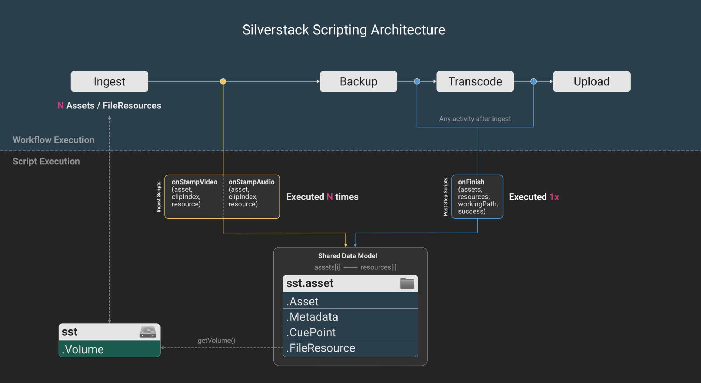

<p align="left">
  
</p>

# Scripting for Silverstack


Scripts provide a structured extension layer for Silverstack's workflows. They allow users and developers to automate tasks, adjust metadata, trigger follow-up actions after jobs finish, or start external tools as part of the workflow execution.

Compatible with:
* Silverstack XT
* Silverstack Lab

More details on how to apply scripts in the user interface, can be found in the [knowledge base](https://kb.pomfort.com/?p=26000).

## 1. Introduction

This the technical documentation for the Silverstack scripting interface which includes the following resources:
* A human-readable reference [`lua-reference.md`](./reference/lua-reference.md)
* A machine-readable [`lua-reference.json`](./reference/lua-reference.json)
* A machine-readable [`schema.json`](./reference/schema.json) for validation and LLM/tooling integration
* See [example scripts](./examples) for practical usage

Scripts can be applied with the following scope:
* Ingest scripts enable you to apply adjustments when ingesting clips into Silverstack (and only then)
* Post step scripts can be added to any workflow activity (besides the ingest) to edit metadata or trigger custom follow-up actions after jobs finish (extending the scope of ingest scripts)

Silverstack offers a dedicated script editor to create, edit and manage scripts that can also handle the different contexts accordingly.

All scripting features are based on **Lua 5.5.0** as programming language and became available with Silverstack version **9.2.0**

### 1.1 Scope

Silverstack's scripting feature is meant to provide users and developers enough flexibility on top of the existing workflow structure to apply custom logic and automation with scripts. Scripts operate inside workflows as event-driven extensions, not as external control interfaces.
Scripting does not include the option to run Silverstack in a headless mode ("API"), nor is it aimed to replace dedicated features within the application.

Scripts allow you to:
* Add and modify metadata within the software
* Automate steps after job execution
* Start your custom external tools, e.g. via `os.execute()`

Scripts cannot:
* Run Silverstack in headless mode
* Manage or execute workflows
* Replace full data processing pipelines
* Provide native built-in support for complex file formats (e.g. CSV, ALE)

Scripts are executed automatically by Silverstack during workflow processing. The application calls predefined entry points (onStampVideo, onFinish) and ingests the corresponding data (e.g. assets, resources) into these functions.
Users do not call these functions manually: They implement them to define behavior at specific stages of the workflow.

### 1.2 Overview

<p align="center">
  
</p>

Scripts are organized file-based into three locations, each serving a specific purpose:
* Default: scripts provided by Pomfort, which can be used as-is or as a starting point for your own adaptations
* Project: scripts that belong to a specific project and ensure project-specific reproducibility over time
* Shared: scripts that are available across projects to support consistent results for multiple projects

You can easily access all locations in the file system via the script editor.

## 2. Architecture & reference

### 2.1 Types

Available types related to assets stored in the Silverstack library:

`asset.Asset`

An asset is a representation of a video clip, audio clip, or document in Silverstack's library. It is not the physical entity of the file stored on (various) disks. An `asset` provides access to clip-related metadata and information. 
During the ingest step of a workflow, a list of assets will be created by Silverstack. The `onStampVideo` and `onStampAudio` functions provided by the API will be called once during ingest on every entry of the list (see also section 2.2.1).
The `onFinish` function will take this entire list as first argument (see section 2.2.2).

`asset.FileResource`

A file resource is a single physical representation of an asset in the library, or simpler: a copy (or instance) represented by an asset. An asset can have multiple file resources on various disks, including the original file on the camera mag / sound recorder card, and all copies created by Silverstack in a backup activity. The `onFinish` function takes a list of all file resources as second argument (see section 2.2.2). Which file resources are used, is determined by the "Input Files" option set in the workflow wizard, from which the script is called.

`asset.Metadata`

Provides access to metadata stored for an asset.

`asset.CuePoint`

Represents a cue point for an asset.

`Volume`

Represents a storage volume available to Silverstack. You can access a volume via a file resource using the function `getVolume`.

All `assets` share the same interface, but their metadata may differ depending on the type. You can call any function on any `asset`, but the function may return `nil`, e.g. when running `setFstop(String) throws -> String?` on audio clip `assets` (that don't have this metadata field).

### 2.2 Contexts

Note: All available functions of Silverstack's scripting API are placed in the global `sst` namespace:

* Show help: `sst.help()`
* Show help for specific types: `sst.help(sst.Folder)` or `sst.help(sst.Asset)`

The complete scripting reference can be accessed via the toolbar in the script editor.

#### 2.2.1 Ingest scripts

```
function onStampVideo(videoClip, clipIndex, resource)
function onStampAudio(audioClip, clipIndex, resource)
```

The mandatory entry point is `onStampVideo` which is executed for **each** `videoClip` of type `asset`.
Optionally, you can use the function `onStampAudio` to run actions for **each** `audioClip`. If you only want to run `onStampAudio`, leave the function `onStampVideo` empty (it still must exist in the script).

The functions `onStampVideo` and `onStampAudio` take three arguments: `asset`, `clipIndex` and `resource`. The first argument `asset` is either a video or audio clip of type `Asset`. The `clipIndex` argument is passed consecutive numbers, identifying the clip that is currently being stamped, starting at 0. The `resource` argument is the `FileResource` associated with `asset`.

You are free to omit unused trailing arguments: `function onStampVideo(videoClip)`

#### 2.2.2 Post step scripts

`function onFinish(assets, resources, workingPath, success)`

The mandatory entry point is `onFinish`. Post step scripts are executed after the activity has finished and only **once** since they receive a list of `assets` as input.

The `onFinish` function accepts four arguments: `assets`, `resources`, `workingPath` and `success`. The `assets` argument is a table containing all documents as well as video and audio clips of type `Asset` handled by the job. The `FileResources` associated with the `assets` are passed into the `resources` argument. Every element in the `resources` table is associated 1:1 to the `assets` element of the same index.

You need to use the “Input Files” popup button located in the script post step section to select if you want to pass the source, destination 1, destination 2, …, destination N file resources into the function.

The `workingPath` argument is a string to a path selected as “Working Path” in the post step section. You may configure it as an global absolute path, or relative to the job’s source or one of its destinations (e.g., backups). The `workingPath` passed into the Lua function will be absolutized.

The last argument `success` is a boolean value, indicating whether the job failed or succeeded.

You are free to omit unused trailing arguments: `function onFinish(assets, _, workingPath)`

#### 2.2.3 Context tags

The context tag of a script defines in which context a script is loaded (e.g., if it is shown in Silverstack's ingest step or post step). For ingest scripts, you can set: `-- sst: ingest` while post step scripts use `-- sst: post-step`. You can also set multiple context tags by separating them with a comma like this: `-- sst: ingest, post-step`.
Multiple context tags can be beneficial if you would like to have one script that can be executed in multiple contexts. It is possible to omit the context tags if you don't want to load a script in the workflow configuration window at all, e.g., to use scripts as working copies / templates.

### 2.3 Execution and error handling

In general, scripts are validated prior to the workflow execution to catch issues like syntax errors. For post step scripts, you can review their execution state by navigating to the right sidebar in the jobs view (see also the [knowledge base](https://kb.pomfort.com/?p=20923)).
If runtime errors occur in post step scripts, they will be stated there. Since ingest scripts are not executed within post steps, they don't have a separate success confirmation. Metadata adjustments will be visible in the library immediately after script execution.

Some functions can throw exceptions. You can identify these functions by the declaration `throws`:
`Metadata:setCameraIndex(String) throws`

It is not necessary to treat these functions separately.
If scripts throw an error, they will be shown in the script editor, the console or propagated to the associated workflow.
The validation of ingest scripts runs immediately in-place: If the script contains an error, the workflow configuration window will show it.

#### 2.3.1 Return values
`function onFinish() -> (String, ...)`

You can optionally return values for post step scripts by using a statement like `return(workingPath)`. The return values will also be shown in the jobs view as mentioned in section 2.3.

### 2.4 Modules (shared libraries)

Reusable modules allow you to define common logic once and use it across multiple scripts. Instead of duplicating code, you can move shared functionality, such as metadata handling or file operations, into a separate Lua file and load it with `require`.

Using modules helps to:
* Reduce duplication across scripts
* Improve maintainability
* Ensure consistent behavior across workflows

A Lua module typically returns a table of functions that can be called from any script:

```
local M = {}

function M.normalizeCameraIndex(cameraIndex)
  return cameraIndex:gsub("_", "")
end

function M.normalizeTake(take)
    return tostring(tonumber(take))
end

return M
```

You can place the code above into a separate Lua file like `myModule.lua` and save it into one of Silverstack's script locations like `Shared`. In the script from which you would like to load the module, you simply set the statement `local module = require("myModule")` and call it with `module.normalizeTake(take)`.

### 2.5 Processing external data

Scripts can read and write external files (e.g. CSV, JSON) using standard Lua file I/O.
Silverstack provides access to the relevant metadata, but does not include built-in parsers or exporters for formats such as ALE or CSV.
These formats can be implemented manually in Lua or processed via external tools triggered from the script. This allows flexible integration into existing pipelines.

## 3. Troubleshooting

Evaluate the type of any variable:
```
local sourceAsset = asset:getTranscodingSourceAsset()
if type(sourceAsset) ~= sst.Asset then
    print("Type is not asset")
end
```

For testing, you can provoke errors like this:
```
error("Source asset is nil!")
```

## 4. Changelog

### Version 1.0 (Wednesday, 14.04.2026)

* Initial public release